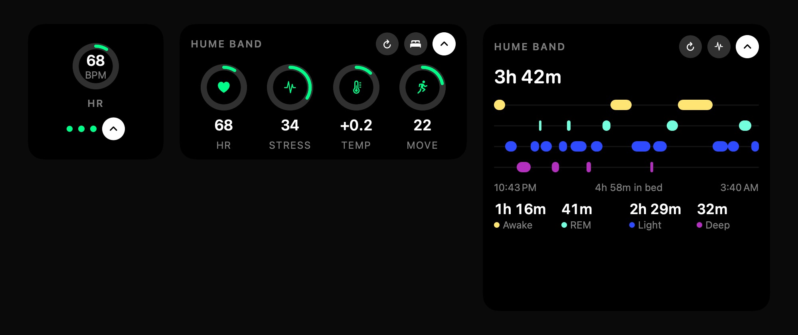
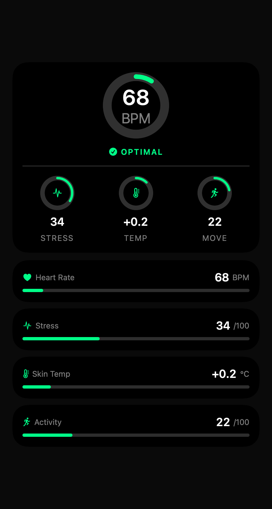
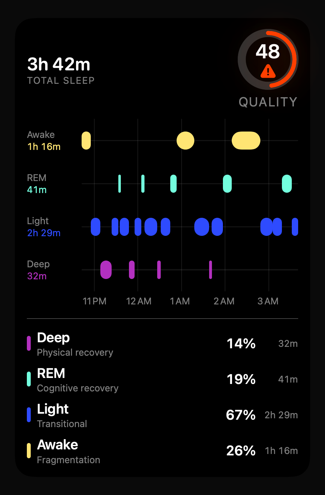
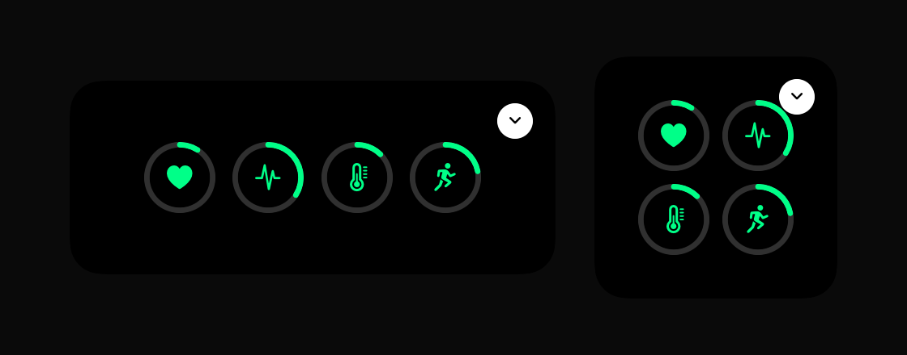
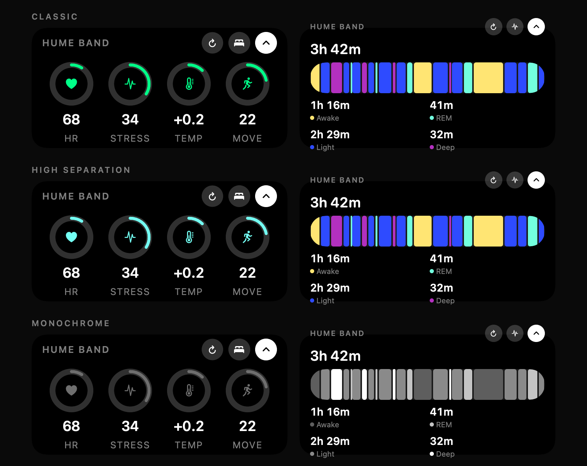

# Hume Band Widget

A macOS widget, dashboard and floating desktop panel for the
[Hume Band 2.0](https://humehealth.com) — plus an iPhone companion that gets
your real readings out of Apple Health and onto your Mac.

Built for **macOS 27** with SwiftUI, WidgetKit and Liquid Glass.



---

## What it is

Four surfaces, one set of data:

| Surface | What it does |
|---|---|
| **WidgetKit widget** | Small, medium, large and extra-large. Vitals or sleep. Collapses to an icon strip. |
| **Dashboard** | The full read: live vitals, last night's sleep, a hypnogram, suggestions. |
| **Desktop panel** | A pill welded to a screen edge that unfolds on hover, floating above everything. |
| **iPhone companion** | Reads your band's data from Apple Health and relays it to the Mac. |

## Where the numbers come from

This matters more than any feature, so it is near the top.

| Metric | Source |
|---|---|
| Heart rate, resting heart rate | **Measured** — Apple Health, via the companion |
| HRV (SDNN) | **Measured** |
| Wrist temperature | **Measured** |
| Sleep stages, bedtime, wake | **Measured** — HealthKit `sleepAnalysis` |
| Activity | Derived from step count against a 10,000-step day |
| Sleep quality score, sleep debt | **Derived here**, not Hume's number — see below |
| **Stress** | **Simulated.** No Apple Health type carries it |

Until you pair a phone, **everything is simulated** — three sine waves on the
clock. The app says so on screen rather than letting invented numbers pass as
real, and once a measured reading arrives it is never replaced by a simulated
one, even as it ages.

Hume computes their Sleep Quality Score in their own app and do not publish
it to Health, so this project derives an approximation from duration, deep
share and continuity. It is in the right ballpark; it is not their figure.

## Why an iPhone relay, and not Bluetooth

Direct Bluetooth was tried first and ruled out by evidence, not assumption.
The band advertises no services, and on connection exposes only `FFF0` and
`190E` with vendor-defined characteristics — no standard Heart Rate service
(`0x180D`), so there is nothing documented to ask it for.

HealthKit does not exist on macOS, so the Mac cannot read your Health data
itself. The phone can. HealthKit is Apple's API, not Hume's, so reading your
own data back needs no vendor account or key — and it carries sleep stages
and HRV that the band's Bluetooth profile never would.

**Settings › Band** still holds that diagnostic: a scanner that lists what is
advertising, dumps a device's GATT tree, and offers a read-only listener for
the vendor characteristics. It never writes to the band.

## Screenshots

| Vitals | Sleep |
|---|---|
|  |  |

**Collapsed** — the widget folds to an icon strip, adapting to the tile:



## Colour vision



Three ramps, switchable from the **View** menu or Settings, and carried
through to the widget and panel.

Each was checked by simulating protanopia, deuteranopia and tritanopia
(Viénot et al. 1999) and measuring the worst-case CIELAB ΔE between states as
each dichromat sees them. Below ~20 is easily confused; above ~40 is
comfortably distinct.

| Palette | dark ΔE | light ΔE |
|---|---|---|
| Classic | 38.0 | **5.7** |
| High separation | 48.6 | 45.9 |
| Monochrome | 26.7 | 24.7 |

That **5.7** is why the feature exists: in light mode the classic ramp's
mid-green and dark amber genuinely are confusable with red–green colour
blindness.

The sleep-stage colours were not chosen by eye either. The Apple-Health-style
set of indigo/blue/cyan/orange scores **7.5**; a hand-tuned "prettier"
version scored **6.0**. Both look fine and are near-useless to a dichromat,
because their cool hues sit at almost the same lightness. A constrained
search produced the shipped values at **45.9 / 41.6**.

Colour is never the only signal — every state also carries its own SF Symbol
and label.

## About "every 10 seconds"

**A widget cannot fetch data every 10 seconds, and no code can make it.**
Each widget gets a background budget of a few dozen refreshes a day.

So: one fetch produces a 180-entry timeline spaced 10s apart, which WidgetKit
steps through without waking the extension — the display advances at no
energy cost. Genuinely new data arrives by `reloadTimelines`, which is free
against the budget. One timeline covers 30 minutes, about 48 refreshes a day.

The relay has its own ceilings, none of them ours: iOS throttles background
Health delivery to roughly hourly, and Hume decides how often the band syncs
into Health at all.

## Layout

```
HumeWidgets/          macOS app + WidgetKit extension
  Shared/             model, palette, design system, views
  HumeApp/            dashboard, settings, floating panel, relay server
  HumeWidget/         timeline provider, widget families
HumeCompanion/        iPhone app — reads HealthKit, sends to the Mac
Config/               signing (gitignored; copy the .example)
docs/images/          the screenshots above
```

The model and wire format are shared **by reference** between the Mac and
iPhone projects, not copied, so the two ends cannot drift apart.

## Building

```bash
cp Config/Signing.xcconfig.example Config/Signing.xcconfig
# put your Apple Developer Team ID in it, then:
open HumeWidgets/HumeWidgets.xcodeproj
```

Both targets need the App Group `<TEAMID>.group.com.tomasroldan.humewidgets`.
macOS is stricter than iOS here: an app-group entitlement requires a real
development certificate — ad-hoc signing is rejected at build time — and the
identifier must carry the team prefix. It is derived from the build setting,
so setting your Team ID is the only step.

For the companion, open `HumeCompanion/HumeCompanion.xcodeproj` and run it on
your phone. Then: Mac **Settings › iPhone › Start receiving**, note the
pairing code, and enter it on the phone.

## Privacy

- Readings travel **only** between your phone and your Mac, over your own
  Wi-Fi. Nothing is uploaded anywhere.
- The Mac accepts **private network addresses only** — loopback, 10/8,
  192.168/16, 172.16–31, link-local. Anything routed from outside is refused
  before the payload is read.
- A six-digit pairing code is checked before a payload is trusted.
- No analytics, no accounts, no API keys.

## Credits

The visual language is adapted from
**[Codenotch](https://github.com/vinzdg/codenotch)** by vinzdg (MIT) — its
three-state colour ramp, its proportional layout system where one anchor
scales everything, its motion curves, and the `NSPanel` configuration behind
the floating desktop panel. Its licence is reproduced in
[licenses/codenotch-LICENSE.txt](licenses/codenotch-LICENSE.txt).

Sleep metric names and definitions follow Hume Health's published
[Sleep Architecture Metrics](https://humehealth.com/blogs/hume-blogs/comprehensive-hume-band-metrics-catalog)
— *Light* rather than Apple's *Core*, stage percentages, and the detail that
Deep/REM/Light are shares of total sleep while Awake is a share of the whole
sleep period. Suggestion guidance quotes their improvement notes.

Not affiliated with or endorsed by Hume Health.

## Licence

MIT — see [LICENSE](LICENSE).
